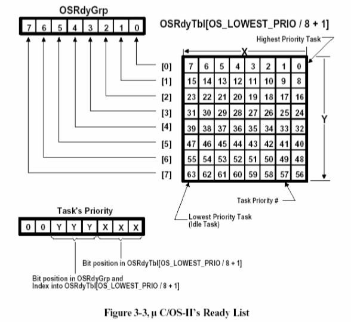
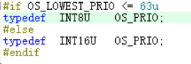
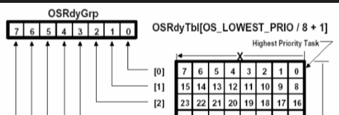

``` c
/*
*********************************************************************************************************
*                                                uC/OS-II
*                                          The Real-Time Kernel
*                                             CORE FUNCTIONS
*
*                              (c) Copyright 1992-2012, Micrium, Weston, FL
*                                           All Rights Reserved
*
* File    : OS_CORE.C
* By      : Jean J. Labrosse
* Version : V2.92.07
*
* LICENSING TERMS:
* ---------------
*   uC/OS-II is provided in source form for FREE evaluation, for educational use or for peaceful research.
* If you plan on using  uC/OS-II  in a commercial product you need to contact Micrium to properly license
* its use in your product. We provide ALL the source code for your convenience and to help you experience
* uC/OS-II.   The fact that the  source is provided does  NOT  mean that you can use it without  paying a
* licensing fee.
*********************************************************************************************************
*/

#define  MICRIUM_SOURCE

#ifndef  OS_MASTER_FILE
#define  OS_GLOBALS
#include <ucos_ii.h>
#endif

/*
*********************************************************************************************************
*                                      PRIORITY RESOLUTION TABLE
*
* Note: Index into table is bit pattern to resolve highest priority
*       Indexed value corresponds to highest priority bit position (i.e. 0..7)
*********************************************************************************************************
表中的索引是用来解析最高优先级的位模式
初始化、启动、中断管理、时钟中断、任务调度及事件处理等用于系统基本维持的函数。
*/

```

1. OSRdyGrp 是用于确定对应的优先级  是OSRdyTbl中的哪一个元素
2. 而 在确定了 元素之后 通过使用priority 的低位（根据OS_PRIO使用的类型来决定位数如右图）

   1. 不同类型的实现具体参照[OSTCBX和OSTCBY相关内容](#priority)
1. 而OSUnMapTbl 则用于查找到指定的 index值的 为1 的最低位
   1. /这是因为 优先值越低的优先级越高
   2. 比如输入 00110100(52) 得到的是 2u 即知道 最低位为第2位
   3. 所以 一次具体的确定就绪的最高优先级任务的操作如下(在函数 OS_SchedNew中)：
	.png)
		1. 在1808 到 1811 之间是针对 OS_PRIO 为INT8U的情况
		y代表的是 OSRdyGrp中为1的最低位，OSRdyTbl[y] 则是优先级最低的Group对应的元素位置
		

```c
INT8U  const  OSUnMapTbl[256] =
{
	0u, 0u, 1u, 0u, 2u, 0u, 1u, 0u, 3u, 0u, 1u, 0u, 2u, 0u, 1u, 0u, /* 0x00 to 0x0F                   */
	4u, 0u, 1u, 0u, 2u, 0u, 1u, 0u, 3u, 0u, 1u, 0u, 2u, 0u, 1u, 0u, /* 0x10 to 0x1F                   */
	5u, 0u, 1u, 0u, 2u, 0u, 1u, 0u, 3u, 0u, 1u, 0u, 2u, 0u, 1u, 0u, /* 0x20 to 0x2F                   */
	4u, 0u, 1u, 0u, 2u, 0u, 1u, 0u, 3u, 0u, 1u, 0u, 2u, 0u, 1u, 0u, /* 0x30 to 0x3F                   */
	6u, 0u, 1u, 0u, 2u, 0u, 1u, 0u, 3u, 0u, 1u, 0u, 2u, 0u, 1u, 0u, /* 0x40 to 0x4F                   */
	4u, 0u, 1u, 0u, 2u, 0u, 1u, 0u, 3u, 0u, 1u, 0u, 2u, 0u, 1u, 0u, /* 0x50 to 0x5F                   */
	5u, 0u, 1u, 0u, 2u, 0u, 1u, 0u, 3u, 0u, 1u, 0u, 2u, 0u, 1u, 0u, /* 0x60 to 0x6F                   */
	4u, 0u, 1u, 0u, 2u, 0u, 1u, 0u, 3u, 0u, 1u, 0u, 2u, 0u, 1u, 0u, /* 0x70 to 0x7F                   */
	7u, 0u, 1u, 0u, 2u, 0u, 1u, 0u, 3u, 0u, 1u, 0u, 2u, 0u, 1u, 0u, /* 0x80 to 0x8F                   */
	4u, 0u, 1u, 0u, 2u, 0u, 1u, 0u, 3u, 0u, 1u, 0u, 2u, 0u, 1u, 0u, /* 0x90 to 0x9F                   */
	5u, 0u, 1u, 0u, 2u, 0u, 1u, 0u, 3u, 0u, 1u, 0u, 2u, 0u, 1u, 0u, /* 0xA0 to 0xAF                   */
	4u, 0u, 1u, 0u, 2u, 0u, 1u, 0u, 3u, 0u, 1u, 0u, 2u, 0u, 1u, 0u, /* 0xB0 to 0xBF                   */
	6u, 0u, 1u, 0u, 2u, 0u, 1u, 0u, 3u, 0u, 1u, 0u, 2u, 0u, 1u, 0u, /* 0xC0 to 0xCF                   */
	4u, 0u, 1u, 0u, 2u, 0u, 1u, 0u, 3u, 0u, 1u, 0u, 2u, 0u, 1u, 0u, /* 0xD0 to 0xDF                   */
	5u, 0u, 1u, 0u, 2u, 0u, 1u, 0u, 3u, 0u, 1u, 0u, 2u, 0u, 1u, 0u, /* 0xE0 to 0xEF                   */
	4u, 0u, 1u, 0u, 2u, 0u, 1u, 0u, 3u, 0u, 1u, 0u, 2u, 0u, 1u, 0u  /* 0xF0 to 0xFF                   */
};

/*$PAGE*/
/*
*********************************************************************************************************
*                                         FUNCTION PROTOTYPES
*********************************************************************************************************
*/

static  void  OS_InitEventList (void);//初始化事件列表

static  void  OS_InitMisc (void);//初始化变量

static  void  OS_InitRdyList (void);//初始化就绪表

static  void  OS_InitTaskIdle (void);//创建和初始化idle任务

#if OS_TASK_STAT_EN > 0u
static  void  OS_InitTaskStat (void);//初始化统计任务
#endif

static  void  OS_InitTCBList (void);//初始化tcb列表

static  void  OS_SchedNew (void);

/*$PAGE*/
/*
*********************************************************************************************************
*                        GET THE NAME OF A SEMAPHORE, MUTEX, MAILBOX or QUEUE
*
* Description: This function is used to obtain the name assigned to a semaphore, mutex, mailbox or queue.
*
* Arguments  : pevent    is a pointer to the event group.  'pevent' can point either to a semaphore,
*                        a mutex, a mailbox or a queue.  Where this function is concerned, the actual
*                        type is irrelevant.
*
*              pname     is a pointer to a pointer to an ASCII string that will receive the name of the semaphore,
*                        mutex, mailbox or queue.
*
*              perr      is a pointer to an error code that can contain one of the following values:
*
*                        OS_ERR_NONE                if the name was copied to 'pname'
*                        OS_ERR_EVENT_TYPE          if 'pevent' is not pointing to the proper event
*                                                   control block type.
*                        OS_ERR_PNAME_NULL          You passed a NULL pointer for 'pname'
*                        OS_ERR_PEVENT_NULL         if you passed a NULL pointer for 'pevent'
*                        OS_ERR_NAME_GET_ISR        if you are trying to call this function from an ISR
*
* Returns    : The length of the string or 0 if the 'pevent' is a NULL pointer.
获取SEMAPHORE，MUTEX，MAILBOX或QUEUE的名称
*
*说明：此函数用于获取分配给信号量，互斥量，邮箱或队列的名称。
*
*参数：pevent是指向事件组的指针。 “ pevent”可以指向一个信号量，
*互斥锁，邮箱或队列。就此功能而言，实际
*类型无关紧要。
*
* pname是指向将接收信号量名称的ASCII字符串的指针，
*互斥锁，邮箱或队列。
*
* perr是指向错误代码的指针，该错误代码可以包含以下值之一：
*
* OS_ERR_NONE，如果名称已复制到“ pname”
* OS_ERR_EVENT_TYPE，如果“ pevent”未指向正确的事件
*控制块类型。
* OS_ERR_PNAME_NULL您为'pname'传递了NULL指针
* OS_ERR_PEVENT_NULL，如果您为'pevent'传递了NULL指针
* OS_ERR_NAME_GET_ISR，如果您尝试从ISR调用此函数
*
*返回：字符串的长度；如果'pevent'是NULL指针，则返回0。
*********************************************************************************************************
*/

#if (OS_EVENT_EN) && (OS_EVENT_NAME_EN > 0u)
INT8U  OSEventNameGet (OS_EVENT   *pevent,
											 INT8U     **pname,
											 INT8U      *perr)
{
	INT8U      len;
#if OS_CRITICAL_METHOD == 3u                     /* Allocate storage for CPU status register           */
	OS_CPU_SR  cpu_sr = 0u;
#endif
#ifdef OS_SAFETY_CRITICAL
	
	if (perr == (INT8U *)0)
	{
		OS_SAFETY_CRITICAL_EXCEPTION();
		return (0u);
	}
	
#endif
#if OS_ARG_CHK_EN > 0u
	
	if (pevent == (OS_EVENT *)0)                 /* Is 'pevent' a NULL pointer?                        */
	{
		*perr = OS_ERR_PEVENT_NULL;
		return (0u);
	}
	
	if (pname == (INT8U **)0)                     /* Is 'pname' a NULL pointer?                         */
	{
		*perr = OS_ERR_PNAME_NULL;
		return (0u);
	}
	
#endif
	
	if (OSIntNesting > 0u)                       /* See if trying to call from an ISR                  */
	{
		*perr  = OS_ERR_NAME_GET_ISR;
		return (0u);
	}
	
	switch (pevent->OSEventType)
	{
		case OS_EVENT_TYPE_SEM:
		case OS_EVENT_TYPE_MUTEX:
		case OS_EVENT_TYPE_MBOX:
		case OS_EVENT_TYPE_Q:
			break;
			
		default:
			*perr = OS_ERR_EVENT_TYPE;
			return (0u);
	}
	
	OS_ENTER_CRITICAL();
	*pname = pevent->OSEventName;
	len    = OS_StrLen (*pname);
	OS_EXIT_CRITICAL();
	*perr  = OS_ERR_NONE;
	return (len);
}
#endif

/*$PAGE*/
/*
*********************************************************************************************************
*                        ASSIGN A NAME TO A SEMAPHORE, MUTEX, MAILBOX or QUEUE
*
* Description: This function assigns a name to a semaphore, mutex, mailbox or queue.
*
* Arguments  : pevent    is a pointer to the event group.  'pevent' can point either to a semaphore,
*                        a mutex, a mailbox or a queue.  Where this function is concerned, it doesn't
*                        matter the actual type.
*
*              pname     is a pointer to an ASCII string that will be used as the name of the semaphore,
*                        mutex, mailbox or queue.
*
*              perr      is a pointer to an error code that can contain one of the following values:
*
*                        OS_ERR_NONE                if the requested task is resumed
*                        OS_ERR_EVENT_TYPE          if 'pevent' is not pointing to the proper event
*                                                   control block type.
*                        OS_ERR_PNAME_NULL          You passed a NULL pointer for 'pname'
*                        OS_ERR_PEVENT_NULL         if you passed a NULL pointer for 'pevent'
*                        OS_ERR_NAME_SET_ISR        if you called this function from an ISR
*
* Returns    : None
将名称分配给SEMAPHORE，MUTEX，MAILBOX或QUEUE
*
*说明：此函数为信号量，互斥量，邮箱或队列分配名称。
*
*参数：pevent是指向事件组的指针。 “ pevent”可以指向一个信号量，
*互斥锁，邮箱或队列。在涉及此功能的地方，它不会
*与实际类型无关。
*
* pname是指向ASCII字符串的指针，该字符串将用作信号灯的名称，
*互斥锁，邮箱或队列。
*
* perr是指向错误代码的指针，该错误代码可以包含以下值之一：
*
* OS_ERR_NONE，如果恢复了所请求的任务
* OS_ERR_EVENT_TYPE，如果“ pevent”未指向正确的事件
*控制块类型。
* OS_ERR_PNAME_NULL您为'pname'传递了NULL指针
* OS_ERR_PEVENT_NULL，如果您为'pevent'传递了NULL指针
* OS_ERR_NAME_SET_ISR（如果您从ISR调用了此函数）
*
*返回：无
*********************************************************************************************************
*/

#if (OS_EVENT_EN) && (OS_EVENT_NAME_EN > 0u)
void  OSEventNameSet (OS_EVENT  *pevent,
											INT8U     *pname,
											INT8U     *perr)
{
#if OS_CRITICAL_METHOD == 3u                     /* Allocate storage for CPU status register           */
	OS_CPU_SR  cpu_sr = 0u;
#endif
#ifdef OS_SAFETY_CRITICAL
	
	if (perr == (INT8U *)0)
	{
		OS_SAFETY_CRITICAL_EXCEPTION();
		return;
	}
	
#endif
#if OS_ARG_CHK_EN > 0u
	
	if (pevent == (OS_EVENT *)0)                 /* Is 'pevent' a NULL pointer?                        */
	{
		*perr = OS_ERR_PEVENT_NULL;
		return;
	}
	
	if (pname == (INT8U *)0)                     /* Is 'pname' a NULL pointer?                         */
	{
		*perr = OS_ERR_PNAME_NULL;
		return;
	}
	
#endif
	
	if (OSIntNesting > 0u)                       /* See if trying to call from an ISR                  */
	{
		*perr = OS_ERR_NAME_SET_ISR;
		return;
	}
	
	switch (pevent->OSEventType)
	{
		case OS_EVENT_TYPE_SEM:
		case OS_EVENT_TYPE_MUTEX:
		case OS_EVENT_TYPE_MBOX:
		case OS_EVENT_TYPE_Q:
			break;
			
		default:
			*perr = OS_ERR_EVENT_TYPE;
			return;
	}
	
	OS_ENTER_CRITICAL();
	pevent->OSEventName = pname;
	OS_EXIT_CRITICAL();
	*perr = OS_ERR_NONE;
}
#endif

/*$PAGE*/
/*
*********************************************************************************************************
*                                       PEND ON MULTIPLE EVENTS
*
* Description: This function waits for multiple events.  If multiple events are ready at the start of the
*              pend call, then all available events are returned as ready.  If the task must pend on the
*              multiple events, then only the first posted or aborted event is returned as ready.
*
* Arguments  : pevents_pend  is a pointer to a NULL-terminated array of event control blocks to wait for.
*
*              pevents_rdy   is a pointer to an array to return which event control blocks are available
*                            or ready.  The size of the array MUST be greater than or equal to the size
*                            of the 'pevents_pend' array, including terminating NULL.
*
*              pmsgs_rdy     is a pointer to an array to return messages from any available message-type
*                            events.  The size of the array MUST be greater than or equal to the size of
*                            the 'pevents_pend' array, excluding the terminating NULL.  Since NULL
*                            messages are valid messages, this array cannot be NULL-terminated.  Instead,
*                            every available message-type event returns its messages in the 'pmsgs_rdy'
*                            array at the same index as the event is returned in the 'pevents_rdy' array.
*                            All other 'pmsgs_rdy' array indices are filled with NULL messages.
*
*              timeout       is an optional timeout period (in clock ticks).  If non-zero, your task will
*                            wait for the resources up to the amount of time specified by this argument.
*                            If you specify 0, however, your task will wait forever for the specified
*                            events or, until the resources becomes available (or the events occur).
*
*              perr          is a pointer to where an error message will be deposited.  Possible error
*                            messages are:
*
*                            OS_ERR_NONE         The call was successful and your task owns the resources
*                                                or, the events you are waiting for occurred; check the
*                                                'pevents_rdy' array for which events are available.
*                            OS_ERR_PEND_ABORT   The wait on the events was aborted; check the
*                                                'pevents_rdy' array for which events were aborted.
*                            OS_ERR_TIMEOUT      The events were not received within the specified
*                                                'timeout'.
*                            OS_ERR_PEVENT_NULL  If 'pevents_pend', 'pevents_rdy', or 'pmsgs_rdy' is a
*                                                NULL pointer.
*                            OS_ERR_EVENT_TYPE   If you didn't pass a pointer to an array of semaphores,
*                                                mailboxes, and/or queues.
*                            OS_ERR_PEND_ISR     If you called this function from an ISR and the result
*                                                would lead to a suspension.
*                            OS_ERR_PEND_LOCKED  If you called this function when the scheduler is locked.
*
* Returns    : >  0          the number of events returned as ready or aborted.
*              == 0          if no events are returned as ready because of timeout or upon error.
*
* Notes      : 1) a. Validate 'pevents_pend' array as valid OS_EVENTs :
*
*                        semaphores, mailboxes, queues
*
*                 b. Return ALL available events and messages, if any
*
*                 c. Add    current task priority as pending to   each events's wait list
*                      Performed in OS_EventTaskWaitMulti()
*
*                 d. Wait on any of multiple events
*
*                 e. Remove current task priority as pending from each events's wait list
*                      Performed in OS_EventTaskRdy(), if events posted or aborted
*
*                 f. Return any event posted or aborted, if any
*                      else
*                    Return timeout
*
*              2) 'pevents_rdy' initialized to NULL PRIOR to all other validation or function handling in
*                 case of any error(s).
挂多个事件
*
*说明：此函数等待多个事件。如果在开始时准备好多个事件
*挂断电话，然后所有可用事件均返回就绪状态。如果任务必须继续
*多个事件，那么只有第一个发布或中止的事件才返回就绪状态。
*
*参数：pevents_pend是指向以NULL结尾的事件控制块数组的指针。
*
* pevents_rdy是指向数组的指针，以返回可用的事件控制块
*或准备好。数组的大小必须大于或等于该大小
*为“ pevents_pend”数组，包括终止NULL。
*
* pmsgs_rdy是指向数组的指针，该数组可以从任何可用的消息类型返回消息
*事件。数组的大小必须大于或等于
*'pevents_pend'数组，不包括终止NULL。由于NULL
*消息是有效消息，此数组不能为NULL终止。代替，
*每个可用的消息类型事件均在“ pmsgs_rdy”中返回其消息
*数组与事件在“ pevents_rdy”数组中返回的索引相同。
*所有其他“ pmsgs_rdy”数组索引均填充有NULL消息。
*
*超时是可选的超时时间（以时钟滴答为单位）。如果非零，您的任务将
*等待资源达到此参数指定的时间。
*如果您指定0，那么您的任务将永远等待指定的时间
*事件，或者直到资源可用（或事件发生）为止。
*
* perr是指向将存储错误消息的位置的指针。可能的错误
*消息是：
*
* OS_ERR_NONE调用成功，您的任务拥有资源
*或者，您正在等待的事件已发生；检查
*'pevents_rdy'数组，有可用的事件。
* OS_ERR_PEND_ABORT等待事件的事件被中止；检查
*'pevents_rdy'数组，事件被中止。
* OS_ERR_TIMEOUT在指定的范围内未收到事件
*                                                '暂停'。
* OS_ERR_PEVENT_NULL如果'pevents_pend'，'pevents_rdy'或'pmsgs_rdy'是
* NULL指针。
* OS_ERR_EVENT_TYPE如果您没有传递指向信号量数组的指针，
*邮箱和/或队列。
* OS_ERR_PEND_ISR如果您是从ISR调用此函数的，则返回结果
*会导致停权。
* OS_ERR_PEND_LOCKED如果在调度程序被锁定时调用了此函数。
*
*返回：> 0返回准备就绪或中止的事件数。
* == 0，如果由于超时或错误而没有任何事件返回就绪状态。
*
*注意：1）a。将“ pevents_pend”数组验证为有效的OS_EVENTs：
*
*信号灯，邮箱，队列
*
* b。返回所有可用的事件和消息（如果有）
*
*                 C。将当前任务优先级作为待处理添加到每个事件的等待列表
*在OS_EventTaskWaitMulti（）中执行
*
* d。等待任何多个事件
*
* e。从每个事件的等待列表中删除当前任务优先级为待处理
*如果事件发布或中止，则在OS_EventTaskRdy（）中执行
*
*                 F。返回任何发布或中止的事件（如果有）
*其他
*返回超时
*
* 2）在所有其他验证或函数处理之前，将“ pevents_rdy”初始化为NULL
*如果有任何错误。
*********************************************************************************************************
*/
*/ //给与事件组，让task 进行这些事件的请求，只有当这些事件中的某一个发生后
		//task 才会继续运行，否则则按照正常流程将程序挂起
		// 只不过使用的 挂起函数是配套的 OS_EventTaskWaitMulti

/*$PAGE*/
#if ((OS_EVENT_EN) && (OS_EVENT_MULTI_EN > 0u))
INT16U  OSEventPendMulti (OS_EVENT  **pevents_pend,
													OS_EVENT  **pevents_rdy,
													void      **pmsgs_rdy,
													INT32U      timeout,
													INT8U      *perr)
{
	OS_EVENT  **pevents;
	OS_EVENT   *pevent;
#if ((OS_Q_EN > 0u) && (OS_MAX_QS > 0u))
	OS_Q       *pq;
#endif
	BOOLEAN     events_rdy;
	INT16U      events_rdy_nbr;
	INT8U       events_stat;
#if (OS_CRITICAL_METHOD == 3u)                          /* Allocate storage for CPU status register    */
	OS_CPU_SR   cpu_sr = 0u;
#endif
#ifdef OS_SAFETY_CRITICAL
	
	if (perr == (INT8U *)0)
	{
		OS_SAFETY_CRITICAL_EXCEPTION();
		return (0u);
	}
	
#endif
#if (OS_ARG_CHK_EN > 0u)
	
	if (pevents_pend == (OS_EVENT **)0)                 /* Validate 'pevents_pend'                     */
	{
		*perr =  OS_ERR_PEVENT_NULL;
		return (0u);
	}
	
	if (*pevents_pend  == (OS_EVENT *)0)                /* Validate 'pevents_pend'                     */
	{
		*perr =  OS_ERR_PEVENT_NULL;
		return (0u);
	}
	
	if (pevents_rdy  == (OS_EVENT **)0)                 /* Validate 'pevents_rdy'                      */
	{
		*perr =  OS_ERR_PEVENT_NULL;
		return (0u);
	}
	
	if (pmsgs_rdy == (void **)0)                        /* Validate 'pmsgs_rdy'                        */
	{
		*perr =  OS_ERR_PEVENT_NULL;
		return (0u);
	}
	
#endif
	*pevents_rdy = (OS_EVENT *)0;                        /* Init array to NULL in case of errors        */
	pevents     =  pevents_pend;
	pevent      = *pevents;
	
	while  (pevent != (OS_EVENT *)0)
	{
		switch (pevent->OSEventType)                    /* Validate event block types                  */
		{
#if (OS_SEM_EN  > 0u)
		
			case OS_EVENT_TYPE_SEM:
				break;
#endif
#if (OS_MBOX_EN > 0u)
				
			case OS_EVENT_TYPE_MBOX:
				break;
#endif
#if ((OS_Q_EN   > 0u) && (OS_MAX_QS > 0u))
				
			case OS_EVENT_TYPE_Q:
				break;
#endif
				
			case OS_EVENT_TYPE_MUTEX:
			case OS_EVENT_TYPE_FLAG:
			default:
				*perr = OS_ERR_EVENT_TYPE;
				return (0u);
		}
		
		pevents++;
		pevent = *pevents;
	}
	
	if (OSIntNesting  > 0u)                             /* See if called from ISR ...                  */
	{
		*perr =  OS_ERR_PEND_ISR;                        /* ... can't PEND from an ISR                  */
		return (0u);
	}
	
	if (OSLockNesting > 0u)                             /* See if called with scheduler locked ...     */
	{
		*perr =  OS_ERR_PEND_LOCKED;                     /* ... can't PEND when locked                  */
		return (0u);
	}
	
	/*$PAGE*/
	events_rdy     =  OS_FALSE;
	events_rdy_nbr =  0u; // 准备好的事件的数量
	events_stat    =  OS_STAT_RDY;
	pevents        =  pevents_pend;
	pevent         = *pevents;
	OS_ENTER_CRITICAL();
	// 先判断事件是否已经准备好了，如果是 则不需要挂起程序
	///根据不同的 事件类型进行不同的操作，这些操作基本和 各个事件类型的 Pend函数做的操作差不多
	
	while (pevent != (OS_EVENT *)0)                     /* See if any events already available         */
	{
		switch (pevent->OSEventType)
		{
#if (OS_SEM_EN > 0u)
		
			case OS_EVENT_TYPE_SEM:
				if (pevent->OSEventCnt > 0u)           /* If semaphore count > 0, resource available; */
				{
					pevent->OSEventCnt--;              /* ... decrement semaphore,                ... */
					*pevents_rdy++ =  pevent;           /* ... and return available semaphore event    */
					events_rdy   =  OS_TRUE;
					*pmsgs_rdy++   = (void *)0;         /* NO message returned  for semaphores         */
					events_rdy_nbr++;
				}
				
				else
				{
					events_stat |=  OS_STAT_SEM;      /* Configure multi-pend for semaphore events   */
				}
				
				break;
#endif
#if (OS_MBOX_EN > 0u)
				
			case OS_EVENT_TYPE_MBOX:
				if (pevent->OSEventPtr != (void *)0)   /* If mailbox NOT empty;                   ... */
				{
					/* ... return available message,           ... */
					*pmsgs_rdy++         = (void *)pevent->OSEventPtr;
					pevent->OSEventPtr  = (void *)0;
					*pevents_rdy++       =  pevent;     /* ... and return available mailbox event      */
					events_rdy         =  OS_TRUE;
					events_rdy_nbr++;
				}
				
				else
				{
					events_stat |= OS_STAT_MBOX;      /* Configure multi-pend for mailbox events     */
				}
				
				break;
#endif
#if ((OS_Q_EN > 0u) && (OS_MAX_QS > 0u))
				
			case OS_EVENT_TYPE_Q:
				pq = (OS_Q *)pevent->OSEventPtr;
				
				if (pq->OSQEntries > 0u)               /* If queue NOT empty;                     ... */
				{
					/* ... return available message,           ... */
					*pmsgs_rdy++ = (void *)*pq->OSQOut++;
					
					if (pq->OSQOut == pq->OSQEnd)      /* If OUT ptr at queue end, ...                */
					{
						pq->OSQOut  = pq->OSQStart;    /* ... wrap   to queue start                   */
					}
					
					pq->OSQEntries--;                  /* Update number of queue entries              */
					*pevents_rdy++ = pevent;            /* ... and return available queue event        */
					events_rdy   = OS_TRUE;
					events_rdy_nbr++;
				}
				
				else
				{
					events_stat |= OS_STAT_Q;         /* Configure multi-pend for queue events       */
				}
				
				break;
#endif
				
			case OS_EVENT_TYPE_MUTEX:
			case OS_EVENT_TYPE_FLAG:
			default:
				OS_EXIT_CRITICAL();
				*pevents_rdy = (OS_EVENT *)0;           /* NULL terminate return event array           */
				*perr        =  OS_ERR_EVENT_TYPE;
				return (events_rdy_nbr);
		}
		
		pevents++;
		pevent = *pevents;
	}
	
	if ( events_rdy == OS_TRUE)                         /* Return any events already available         */
	{
		*pevents_rdy = (OS_EVENT *)0;                    /* NULL terminate return event array           */
		OS_EXIT_CRITICAL();
		*perr        =  OS_ERR_NONE;
		return (events_rdy_nbr);
	}
	
	/*$PAGE*/
	/* Otherwise, must wait until any event occurs */
	OSTCBCur->OSTCBStat     |= events_stat  |           /* Resource not available, ...                 */
														 OS_STAT_MULTI;           /* ... pend on multiple events                 */
	OSTCBCur->OSTCBStatPend  = OS_STAT_PEND_OK;
	OSTCBCur->OSTCBDly       = timeout;                 /* Store pend timeout in TCB                   */
	OS_EventTaskWaitMulti (pevents_pend);               /* Suspend task until events or timeout occurs */
	OS_EXIT_CRITICAL();
	OS_Sched();                                         /* Find next highest priority task ready       */
	OS_ENTER_CRITICAL();
	
	switch (OSTCBCur->OSTCBStatPend)                    /* Handle event posted, aborted, or timed-out  */
	{

		// 对于 OK 和 ABORT的情况
			// OSTCBEventPtr 通常通过 OS_EventTaskRdy 或是 OS_EventTaskWait 来设置（后者是等待单个事件的时候 的时候）
		case OS_STAT_PEND_OK:
		case OS_STAT_PEND_ABORT:
			pevent = OSTCBCur->OSTCBEventPtr;
			
			if (pevent != (OS_EVENT *)0)               /* If task event ptr != NULL, ...              */
			{
				*pevents_rdy++   =  pevent;             /* ... return available event ...              */
				*pevents_rdy     = (OS_EVENT *)0;       /* ... & NULL terminate return event array     */
				events_rdy_nbr =  1;
			}
			
			else                                       /* Else NO event available, handle as timeout  */
			{
				OSTCBCur->OSTCBStatPend = OS_STAT_PEND_TO;
				OS_EventTaskRemoveMulti (OSTCBCur, pevents_pend);
			}
			
			break;
			
		case OS_STAT_PEND_TO:                           /* If events timed out, ...                    */
		default:                                        /* ... remove task from events' wait lists     */
			OS_EventTaskRemoveMulti (OSTCBCur, pevents_pend);
			break;
	}
	
	switch (OSTCBCur->OSTCBStatPend)
	{
		case OS_STAT_PEND_OK:
			switch (pevent->OSEventType)               /* Return event's message                      */
			{
#if (OS_SEM_EN > 0u)
			
				case OS_EVENT_TYPE_SEM:
					*pmsgs_rdy++ = (void *)0;          /* NO message returned for semaphores          */
					break;
#endif
#if ((OS_MBOX_EN > 0u) ||                 \
    ((OS_Q_EN    > 0u) && (OS_MAX_QS > 0u)))
					
				case OS_EVENT_TYPE_MBOX:
				case OS_EVENT_TYPE_Q:
					*pmsgs_rdy++ = (void *)OSTCBCur->OSTCBMsg;     /* Return received message         */
					break;
#endif
					
				case OS_EVENT_TYPE_MUTEX:
				case OS_EVENT_TYPE_FLAG:
				default:
					OS_EXIT_CRITICAL();
					*pevents_rdy = (OS_EVENT *)0;      /* NULL terminate return event array           */
					*perr        =  OS_ERR_EVENT_TYPE;
					return (events_rdy_nbr);
			}
			
			*perr = OS_ERR_NONE;
			break;
			
		case OS_STAT_PEND_ABORT:
			*pmsgs_rdy++ = (void *)0;                   /* NO message returned for abort               */
			*perr        =  OS_ERR_PEND_ABORT;          /* Indicate that event  aborted                */
			break;
			
		case OS_STAT_PEND_TO:
		default:
			*pmsgs_rdy++ = (void *)0;                   /* NO message returned for timeout             */
			*perr        =  OS_ERR_TIMEOUT;             /* Indicate that events timed out              */
			break;
	}
	
	OSTCBCur->OSTCBStat          =  OS_STAT_RDY;        /* Set   task  status to ready                 */
	OSTCBCur->OSTCBStatPend      =  OS_STAT_PEND_OK;    /* Clear pend  status                          */
	OSTCBCur->OSTCBEventPtr      = (OS_EVENT  *)0;      /* Clear event pointers                        */
	OSTCBCur->OSTCBEventMultiPtr = (OS_EVENT **)0;
#if ((OS_MBOX_EN > 0u) ||                 \
    ((OS_Q_EN    > 0u) && (OS_MAX_QS > 0u)))
	OSTCBCur->OSTCBMsg           = (void      *)0;      /* Clear task  message                         */
#endif
	OS_EXIT_CRITICAL();
	return (events_rdy_nbr);
}
#endif

/*$PAGE*/
/*
*********************************************************************************************************
*                                           INITIALIZATION
*
* Description: This function is used to initialize the internals of uC/OS-II and MUST be called prior to
*              creating any uC/OS-II object and, prior to calling OSStart().
*
* Arguments  : none
*初始化函数
* Returns    : none
初始化
*
*说明：此函数用于初始化uC / OS-II的内部，并且必须在调用之前
*在调用OSStart（）之前，创建任何uC / OS-II对象。
*
*参数：无
*初始化函数
*返回：无
*********************************************************************************************************
*/

void  OSInit (void)
{
	OSInitHookBegin();                                           /* 调用用户特定的初始化代码（通过一个接口函数实现用户要求的插件式进入系统中）*/
	OS_InitMisc();                                            /* 初始化变量*/   
	OS_InitRdyList();                                            /* 初始化就绪列表*/
	OS_InitTCBList();                                           /* 初始化OS_TCB空闲列表*/
	OS_InitEventList();                                          /* 初始化OS_EVENT空闲列表*/
#if (OS_FLAG_EN > 0u) && (OS_MAX_FLAGS > 0u)
	OS_FlagInit();                                               /* 初始化实践标志结构     */
#endif
#if (OS_MEM_EN > 0u) && (OS_MAX_MEM_PART > 0u)
	OS_MemInit();                                                /* 初始化内存管理器*/
#endif
#if (OS_Q_EN > 0u) && (OS_MAX_QS > 0u)
	OS_QInit();                                                  /* 初始化队列消息  */
#endif
	OS_InitTaskIdle();                                           /* 创建空闲任务                   */
#if OS_TASK_STAT_EN > 0u
	OS_InitTaskStat();                                           /* 创建统计任务               */
#endif
#if OS_TMR_EN > 0u
	OSTmr_Init();                                                /*初始化时间管理器             */
#endif
	OSInitHookEnd();                                             /* 调用用户特定的初始化代码            */
#if OS_DEBUG_EN > 0u
	OSDebugInit();
#endif
}
/*$PAGE*/
/*
*********************************************************************************************************
*                                              ENTER ISR
*
* Description: This function is used to notify uC/OS-II that you are about to service an interrupt
*              service routine (ISR).  This allows uC/OS-II to keep track of interrupt nesting and thus
*              only perform rescheduling at the last nested ISR.
*
* Arguments  : none
*
* Returns    : none
*
* Notes      : 1) This function should be called with interrupts already disabled
*              2) Your ISR can directly increment OSIntNesting without calling this function because
*                 OSIntNesting has been declared 'global'.
*              3) You MUST still call OSIntExit() even though you increment OSIntNesting directly.
*              4) You MUST invoke OSIntEnter() and OSIntExit() in pair.  In other words, for every call
*                 to OSIntEnter() at the beginning of the ISR you MUST have a call to OSIntExit() at the
*                 end of the ISR.
*              5) You are allowed to nest interrupts up to 255 levels deep.
*              6) I removed the OS_ENTER_CRITICAL() and OS_EXIT_CRITICAL() around the increment because
*                 OSIntEnter() is always called with interrupts disabled.

实时性主要体现在对于中断的响应上，要求要尽可能快地响应中断，在中断处理程序中快速处理
*********************************************************************************************************
*/

void  OSIntEnter (void)
{
	if (OSRunning == OS_TRUE)
	{
		if (OSIntNesting < 255u)
		{
			OSIntNesting++;                      /* Increment ISR nesting level                        */
		}
	}
}
/*$PAGE*/
/*
*********************************************************************************************************
*                                              EXIT ISR
*
* Description: This function is used to notify uC/OS-II that you have completed servicing an ISR.  When
*              the last nested ISR has completed, uC/OS-II will call the scheduler to determine whether
*              a new, high-priority task, is ready to run.
*
* Arguments  : none
*
* Returns    : none
*
* Notes      : 1) You MUST invoke OSIntEnter() and OSIntExit() in pair.  In other words, for every call
*                 to OSIntEnter() at the beginning of the ISR you MUST have a call to OSIntExit() at the
*                 end of the ISR.
*              2) Rescheduling is prevented when the scheduler is locked (see OS_SchedLock())
*********************************************************************************************************
*/

void  OSIntExit (void)
{
#if OS_CRITICAL_METHOD == 3u                               /* Allocate storage for CPU status register */
	OS_CPU_SR  cpu_sr = 0u;
#endif
	
	if (OSRunning == OS_TRUE)
	{
		OS_ENTER_CRITICAL();
		
		if (OSIntNesting > 0u)                             /* Prevent OSIntNesting from wrapping       */
		{
			OSIntNesting--;
		}
		
		if (OSIntNesting == 0u)                            /* Reschedule only if all ISRs complete ... */
		{
			if (OSLockNesting == 0u)                       /* ... and not locked.                      */
			{
				OS_SchedNew(); // 找到最高优先级的 task 即 找到 OSPrioHighRdy
				OSTCBHighRdy = OSTCBPrioTbl[OSPrioHighRdy];
				
				if (OSPrioHighRdy != OSPrioCur)            /* No Ctx Sw if current task is highest rdy */
				{
#if OS_TASK_PROFILE_EN > 0u
					//此任务被切换进入的次数 增加
					OSTCBHighRdy->OSTCBCtxSwCtr++;         /* Inc. # of context switches to this task  */
#endif
					OSCtxSwCtr++;                          /* Keep track of the number of ctx switches */
					// 为汇编函数
					OSIntCtxSw();                          /* Perform interrupt level ctx switch       */
				}
			}
		}
		
		OS_EXIT_CRITICAL();
	}
}
/*$PAGE*/
/*
*********************************************************************************************************
*                         INDICATE THAT IT'S NO LONGER SAFE TO CREATE OBJECTS
*
* Description: This function is called by the application code to indicate that all initialization has
*              been completed and that kernel objects are no longer allowed to be created.
*
* Arguments  : none
*
* Returns    : none
*
* Note(s)    : 1) You should call this function when you no longer want to allow application code to
*                 create kernel objects.
*              2) You need to define the macro 'OS_SAFETY_CRITICAL_IEC61508'
*********************************************************************************************************
*/

#ifdef OS_SAFETY_CRITICAL_IEC61508
void  OSSafetyCriticalStart (void)
{
	OSSafetyCriticalStartFlag = OS_TRUE;
}

#endif

/*$PAGE*/
/*
*********************************************************************************************************
*                                         PREVENT SCHEDULING
*
* Description: This function is used to prevent rescheduling to take place.  This allows your application
*              to prevent context switches until you are ready to permit context switching.
*
* Arguments  : none
*
* Returns    : none
*
* Notes      : 1) You MUST invoke OSSchedLock() and OSSchedUnlock() in pair.  In other words, for every
*                 call to OSSchedLock() you MUST have a call to OSSchedUnlock().
*********************************************************************************************************
*/

#if OS_SCHED_LOCK_EN > 0u
void  OSSchedLock (void)
{
#if OS_CRITICAL_METHOD == 3u                     /* Allocate storage for CPU status register           */
	OS_CPU_SR  cpu_sr = 0u;
#endif
	
	if (OSRunning == OS_TRUE)                    /* Make sure multitasking is running                  */
	{
		OS_ENTER_CRITICAL();
		
		if (OSIntNesting == 0u)                  /* Can't call from an ISR                             */
		{
			if (OSLockNesting < 255u)            /* Prevent OSLockNesting from wrapping back to 0      */
			{
				OSLockNesting++;                 /* Increment lock nesting level                       */
			}
		}
		
		OS_EXIT_CRITICAL();
	}
}
#endif

/*$PAGE*/
/*
*********************************************************************************************************
*                                          ENABLE SCHEDULING
*
* Description: This function is used to re-allow rescheduling.
*
* Arguments  : none
*
* Returns    : none
*
* Notes      : 1) You MUST invoke OSSchedLock() and OSSchedUnlock() in pair.  In other words, for every
*                 call to OSSchedLock() you MUST have a call to OSSchedUnlock().
*********************************************************************************************************
*/

#if OS_SCHED_LOCK_EN > 0u
void  OSSchedUnlock (void)
{
#if OS_CRITICAL_METHOD == 3u                               /* Allocate storage for CPU status register */
	OS_CPU_SR  cpu_sr = 0u;
#endif
	
	if (OSRunning == OS_TRUE)                              /* Make sure multitasking is running        */
	{
		OS_ENTER_CRITICAL();
		
		if (OSIntNesting == 0u)                            /* Can't call from an ISR                   */
		{
			if (OSLockNesting > 0u)                        /* Do not decrement if already 0            */
			{
				OSLockNesting--;                           /* Decrement lock nesting level             */
				
				if (OSLockNesting == 0u)                   /* See if scheduler is enabled              */
				{
					OS_EXIT_CRITICAL();
					OS_Sched();                            /* See if a HPT is ready                    */
				}
				
				else
				{
					OS_EXIT_CRITICAL();
				}
			}
			
			else
			{
				OS_EXIT_CRITICAL();
			}
		}
		
		else
		{
			OS_EXIT_CRITICAL();
		}
	}
}
#endif

/*$PAGE*/
/*
*********************************************************************************************************
*                                         START MULTITASKING
*
* Description: This function is used to start the multitasking process which lets uC/OS-II manages the
*              task that you have created.  Before you can call OSStart(), you MUST have called OSInit()
*              and you MUST have created at least one task.
*
* Arguments  : none
*
* Returns    : none
*
* Note       : OSStartHighRdy() MUST:
*                 a) Call OSTaskSwHook() then,
*                 b) Set OSRunning to OS_TRUE.
*                 c) Load the context of the task pointed to by OSTCBHighRdy.
*                 d_ Execute the task.
*********************************************************************************************************
*/

void  OSStart (void)
{
	if (OSRunning == OS_FALSE)
	{
		OS_SchedNew();                               /* Find highest priority's task priority number   */
		OSPrioCur     = OSPrioHighRdy;
		OSTCBHighRdy  = OSTCBPrioTbl[OSPrioHighRdy]; /* Point to highest priority task ready to run    */
		OSTCBCur      = OSTCBHighRdy;
		OSStartHighRdy();                            /* Execute target specific code to start task     */
	}
}
/*$PAGE*/
/*
*********************************************************************************************************
*                                      STATISTICS INITIALIZATION
*
* Description: This function is called by your application to establish CPU usage by first determining
*              how high a 32-bit counter would count to in 1 second if no other tasks were to execute
*              during that time.  CPU usage is then determined by a low priority task which keeps track
*              of this 32-bit counter every second but this time, with other tasks running.  CPU usage is
*              determined by:
*
*                                             OSIdleCtr
*                 CPU Usage (%) = 100 * (1 - ------------)
*                                            OSIdleCtrMax
*
* Arguments  : none
*
* Returns    : none
*********************************************************************************************************
*/

#if OS_TASK_STAT_EN > 0u
void  OSStatInit (void)
{
#if OS_CRITICAL_METHOD == 3u                     /* Allocate storage for CPU status register           */
	OS_CPU_SR  cpu_sr = 0u;
#endif
	OSTimeDly (2u);                              /* Synchronize with clock tick                        */
	OS_ENTER_CRITICAL();
	OSIdleCtr    = 0uL;                          /* Clear idle counter                                 */
	OS_EXIT_CRITICAL();
	OSTimeDly (OS_TICKS_PER_SEC / 10u);          /* Determine MAX. idle counter value for 1/10 second  */
	OS_ENTER_CRITICAL();
	// 使用0.1s 让cpu只运行 idle来获得预期的最大的 CPUIdleCtr
	OSIdleCtrMax = OSIdleCtr;                    /* Store maximum idle counter count in 1/10 second    */
	OSStatRdy    = OS_TRUE;
	OS_EXIT_CRITICAL();
}
#endif
/*$PAGE*/
/*
*********************************************************************************************************
*                                         PROCESS SYSTEM TICK
*
* Description: This function is used to signal to uC/OS-II the occurrence of a 'system tick' (also known
*              as a 'clock tick').  This function should be called by the ticker ISR but, can also be
*              called by a high priority task.
*
* Arguments  : none
*
* Returns    : none
*********************************************************************************************************
*/

void  OSTimeTick (void)
{
	OS_TCB    *ptcb;
#if OS_TICK_STEP_EN > 0u
	BOOLEAN    step;
#endif
#if OS_CRITICAL_METHOD == 3u                               /* Allocate storage for CPU status register     */
	OS_CPU_SR  cpu_sr = 0u;
#endif
#if OS_TIME_TICK_HOOK_EN > 0u
	OSTimeTickHook();                                      /* Call user definable hook                     */
#endif
#if OS_TIME_GET_SET_EN > 0u
	OS_ENTER_CRITICAL();                                   /* Update the 32-bit tick counter               */
	OSTime++;
	OS_EXIT_CRITICAL();
#endif
	
	if (OSRunning == OS_TRUE)
	{
#if OS_TICK_STEP_EN > 0u
	
		switch (OSTickStepState)                           /* Determine whether we need to process a tick  */
		{
			case OS_TICK_STEP_DIS:                         /* Yes, stepping is disabled                    */
				step = OS_TRUE;
				break;
				
			case OS_TICK_STEP_WAIT:                        /* No,  waiting for uC/OS-View to set ...       */
				step = OS_FALSE;                          /*      .. OSTickStepState to OS_TICK_STEP_ONCE */
				break;
				
			case OS_TICK_STEP_ONCE:                        /* Yes, process tick once and wait for next ... */
				step            = OS_TRUE;                /*      ... step command from uC/OS-View        */
				OSTickStepState = OS_TICK_STEP_WAIT;
				break;
				
			default:                                       /* Invalid case, correct situation              */
				step            = OS_TRUE;
				OSTickStepState = OS_TICK_STEP_DIS;
				break;
		}
		
		if (step == OS_FALSE)                              /* Return if waiting for step command           */
		{
			return;
		}
		
#endif
		ptcb = OSTCBList;                                  /* Point at first TCB in TCB list               */
		
		while (ptcb->OSTCBPrio != OS_TASK_IDLE_PRIO)       /* Go through all TCBs in TCB list              */
		{
			OS_ENTER_CRITICAL();
			
			if (ptcb->OSTCBDly != 0u)                      /* No, Delayed or waiting for event with TO     */
			{
				ptcb->OSTCBDly--;                          /* Decrement nbr of ticks to end of delay       */
				
				if (ptcb->OSTCBDly == 0u)                  /* Check for timeout                            */
				{
					if ((ptcb->OSTCBStat & OS_STAT_PEND_ANY) != OS_STAT_RDY)
					{// 如果在 进行 任意消息的等待OS_STAT_PEND_ANY = (OS_STAT_SEM | OS_STAT_MBOX | OS_STAT_Q | OS_STAT_MUTEX | OS_STAT_FLAG)
							// 则 清空 并设置 pend状态为 timeout 而非 ok（因为等待的事件没发生，而触发了timeout）
						ptcb->OSTCBStat  &= (INT8U)~ (INT8U)OS_STAT_PEND_ANY;         /* Yes, Clear status flag   */
						ptcb->OSTCBStatPend = OS_STAT_PEND_TO;                 /* Indicate PEND timeout    */
					}
					else
					{
						ptcb->OSTCBStatPend = OS_STAT_PEND_OK;
					}
					// 如果 任务 没有被挂起 则应该 加入到 就绪队列中 就绪
						// 需要注意的是 pend 状态并不等于挂起 状态
						// 如果 挂起了 那么即使受到的信息都不会被运行
							// 除非 执行了 OSTaskResume
					if ((ptcb->OSTCBStat & OS_STAT_SUSPEND) == OS_STAT_RDY)    /* Is task suspended?       */
					{// 一个任务进入就绪态的过程如下，注意没有使用OSMapTbl 而是使用了ptcb的成员 OSTCBBitY/X
							// 此外 类似于  prior >> 3 的过程也被 成员 OSTCBY替代
						OSRdyGrp               |= ptcb->OSTCBBitY;             /* No,  Make ready          */
						OSRdyTbl[ptcb->OSTCBY] |= ptcb->OSTCBBitX;			
					}
				}
			}
			
			ptcb = ptcb->OSTCBNext;                        /* Point at next TCB in TCB list                */
			OS_EXIT_CRITICAL();
		}
	}
}

/*$PAGE*/
/*
*********************************************************************************************************
*                                             GET VERSION
*
* Description: This function is used to return the version number of uC/OS-II.  The returned value
*              corresponds to uC/OS-II's version number multiplied by 10000.  In other words, version
*              2.01.00 would be returned as 20100.
*
* Arguments  : none
*
* Returns    : The version number of uC/OS-II multiplied by 10000.
*********************************************************************************************************
*/

INT16U  OSVersion (void)
{
	return (OS_VERSION);
}

/*$PAGE*/
/*
*********************************************************************************************************
*                                           DUMMY FUNCTION
*
* Description: This function doesn't do anything.  It is called by OSTaskDel().
*
* Arguments  : none
*
* Returns    : none
*********************************************************************************************************
*/

#if OS_TASK_DEL_EN > 0u
void  OS_Dummy (void)
{
}
#endif

/*$PAGE*/
/*
*********************************************************************************************************
*                           MAKE TASK READY TO RUN BASED ON EVENT OCCURING
*
* Description: This function is called by other uC/OS-II services and is used to ready a task that was
*              waiting for an event to occur.
*
* Arguments  : pevent      is a pointer to the event control block corresponding to the event.
*
*              pmsg        is a pointer to a message.  This pointer is used by message oriented services
*                          such as MAILBOXEs and QUEUEs.  The pointer is not used when called by other
*                          service functions.
*
*              msk         is a mask that is used to clear the status byte of the TCB.  For example,
*                          OSSemPost() will pass OS_STAT_SEM, OSMboxPost() will pass OS_STAT_MBOX etc.
*
*              pend_stat   is used to indicate the readied task's pending status:
*
*                          OS_STAT_PEND_OK      Task ready due to a post (or delete), not a timeout or
*                                               an abort.
*                          OS_STAT_PEND_ABORT   Task ready due to an abort.
*
* Returns    : none
*
* Note       : This function is INTERNAL to uC/OS-II and your application should not call it.
*********************************************************************************************************
*/
#if (OS_EVENT_EN)
INT8U  OS_EventTaskRdy (OS_EVENT  *pevent,
												void      *pmsg,
												INT8U      msk,
												INT8U      pend_stat)
{
	OS_TCB   *ptcb;
	INT8U     y;
	INT8U     x;
	INT8U     prio;
#if OS_LOWEST_PRIO > 63u
	OS_PRIO  *ptbl;
#endif
#if OS_LOWEST_PRIO <= 63u
	y    = OSUnMapTbl[pevent->OSEventGrp];              /* Find HPT waiting for message                */
	x    = OSUnMapTbl[pevent->OSEventTbl[y]];
	prio = (INT8U) ((y << 3u) + x);                     /* Find priority of task getting the msg       */
#else
	
	if ((pevent->OSEventGrp & 0xFFu) != 0u)             /* Find HPT waiting for message                */
	{
		y = OSUnMapTbl[ pevent->OSEventGrp & 0xFFu];
	}
	
	else
	{
		y = OSUnMapTbl[ (OS_PRIO) (pevent->OSEventGrp >> 8u) & 0xFFu] + 8u;
	}
	
	ptbl = &pevent->OSEventTbl[y];
	
	if ((*ptbl & 0xFFu) != 0u)
	{
		x = OSUnMapTbl[*ptbl & 0xFFu];
	}
	
	else
	{
		x = OSUnMapTbl[ (OS_PRIO) (*ptbl >> 8u) & 0xFFu] + 8u;
	}
	
	prio = (INT8U) ((y << 4u) + x);                     /* Find priority of task getting the msg       */
#endif
	ptcb                  =  OSTCBPrioTbl[prio];        /* Point to this task's OS_TCB                 */
	ptcb->OSTCBDly        =  0u;                        /* Prevent OSTimeTick() from readying task     */
#if ((OS_Q_EN > 0u) && (OS_MAX_QS > 0u)) || (OS_MBOX_EN > 0u)
	ptcb->OSTCBMsg        =  pmsg;                      /* Send message directly to waiting task       */
#else
	pmsg                  =  pmsg;                      /* Prevent compiler warning if not used        */
#endif
	ptcb->OSTCBStat      &= (INT8U)~msk;                /* Clear bit associated with event type        */
	ptcb->OSTCBStatPend   =  pend_stat;                 /* Set pend status of post or abort            */
	
	/* See if task is ready (could be susp'd)      */
	if ((ptcb->OSTCBStat &   OS_STAT_SUSPEND) == OS_STAT_RDY)
	{
		OSRdyGrp         |=  ptcb->OSTCBBitY;           /* Put task in the ready to run list           */
		OSRdyTbl[y]      |=  ptcb->OSTCBBitX;
	}
	
	OS_EventTaskRemove (ptcb, pevent);                  /* Remove this task from event   wait list     */
#if (OS_EVENT_MULTI_EN > 0u)
	// 对于 等待多个事件的情况
	if (ptcb->OSTCBEventMultiPtr != (OS_EVENT **)0)     /* Remove this task from events' wait lists    */
	{
		OS_EventTaskRemoveMulti (ptcb, ptcb->OSTCBEventMultiPtr);//将此任务从这些事件的列表中直接删除
		ptcb->OSTCBEventPtr       = (OS_EVENT  *)pevent;/* Return event as first multi-pend event ready*/
		// 然后设置OSTCBEventPtr 为 此event（第一个发生的event）
			// 该变量 主要是用于 OSEventPendMulti 函数来判断 是哪一个事件让task恢复运作
	}
	
#endif
	return (prio);
}
#endif
/*$PAGE*/
/*
*********************************************************************************************************
*                                  MAKE TASK WAIT FOR EVENT TO OCCUR
*
* Description: This function is called by other uC/OS-II services to suspend a task because an event has
*              not occurred.
*
* Arguments  : pevent   is a pointer to the event control block for which the task will be waiting for.
*
* Returns    : none
*
* Note       : This function is INTERNAL to uC/OS-II and your application should not call it.
*********************************************************************************************************
*/
#if (OS_EVENT_EN)
void  OS_EventTaskWait (OS_EVENT *pevent)
{
	INT8U  y;
	OSTCBCur->OSTCBEventPtr               = pevent;                 /* Store ptr to ECB in TCB         */
	pevent->OSEventTbl[OSTCBCur->OSTCBY] |= OSTCBCur->OSTCBBitX;    /* Put task in waiting list        */
	pevent->OSEventGrp                   |= OSTCBCur->OSTCBBitY;
	y             =  OSTCBCur->OSTCBY;            /* Task no longer ready                              */
	OSRdyTbl[y]  &= (OS_PRIO)~OSTCBCur->OSTCBBitX; //当前任务进入休眠
	
	if (OSRdyTbl[y] == 0u)                        /* Clear event grp bit if this was only task pending */
	{
		OSRdyGrp &= (OS_PRIO)~OSTCBCur->OSTCBBitY;
	}
}
#endif
/*$PAGE*/
/*
*********************************************************************************************************
*                         MAKE TASK WAIT FOR ANY OF MULTIPLE EVENTS TO OCCUR
*
* Description: This function is called by other uC/OS-II services to suspend a task because any one of
*              multiple events has not occurred.
*
* Arguments  : pevents_wait     is a pointer to an array of event control blocks, NULL-terminated, for
*                               which the task will be waiting for.
*
* Returns    : none.
*
* Note       : This function is INTERNAL to uC/OS-II and your application should not call it.
*********************************************************************************************************
*/
#if ((OS_EVENT_EN) && (OS_EVENT_MULTI_EN > 0u))
void  OS_EventTaskWaitMulti (OS_EVENT **pevents_wait)
{
	OS_EVENT **pevents;
	OS_EVENT  *pevent;
	INT8U      y;
	// 由于是多任务 所以 直到其中的一个 evnet 被触发前无法判定 具体是哪一个 event
	OSTCBCur->OSTCBEventPtr      = (OS_EVENT  *)0;
	OSTCBCur->OSTCBEventMultiPtr = (OS_EVENT **)pevents_wait;       /* Store ptr to ECBs in TCB        */
	pevents =  pevents_wait;
	pevent  = *pevents;
	
	while (pevent != (OS_EVENT *)0)                                 /* Put task in waiting lists       */
	{
		pevent->OSEventTbl[OSTCBCur->OSTCBY] |= OSTCBCur->OSTCBBitX;
		pevent->OSEventGrp                   |= OSTCBCur->OSTCBBitY;
		pevents++;
		pevent = *pevents;
	}
	
	y             =  OSTCBCur->OSTCBY;            /* Task no longer ready                              */
	OSRdyTbl[y]  &= (OS_PRIO)~OSTCBCur->OSTCBBitX;
	
	if (OSRdyTbl[y] == 0u)                        /* Clear event grp bit if this was only task pending */
	{
		OSRdyGrp &= (OS_PRIO)~OSTCBCur->OSTCBBitY;
	}
}
#endif
/*$PAGE*/
/*
*********************************************************************************************************
*                                  REMOVE TASK FROM EVENT WAIT LIST
*
* Description: Remove a task from an event's wait list.
*
* Arguments  : ptcb     is a pointer to the task to remove.
*
*              pevent   is a pointer to the event control block.
*
* Returns    : none
*
* Note       : This function is INTERNAL to uC/OS-II and your application should not call it.
*********************************************************************************************************
*/
#if (OS_EVENT_EN)
void  OS_EventTaskRemove (OS_TCB   *ptcb,
													OS_EVENT *pevent)
{
	INT8U  y;
	y                       =  ptcb->OSTCBY;
	pevent->OSEventTbl[y]  &= (OS_PRIO)~ptcb->OSTCBBitX;    /* Remove task from wait list              */
	
	if (pevent->OSEventTbl[y] == 0u)
	{
		pevent->OSEventGrp &= (OS_PRIO)~ptcb->OSTCBBitY;
	}
}
#endif
/*$PAGE*/
/*
*********************************************************************************************************
*                             REMOVE TASK FROM MULTIPLE EVENTS WAIT LISTS
*
* Description: Remove a task from multiple events' wait lists.
*
* Arguments  : ptcb             is a pointer to the task to remove.
*
*              pevents_multi    is a pointer to the array of event control blocks, NULL-terminated.
*
* Returns    : none
*
* Note       : This function is INTERNAL to uC/OS-II and your application should not call it.
*********************************************************************************************************
*/
#if ((OS_EVENT_EN) && (OS_EVENT_MULTI_EN > 0u))
void  OS_EventTaskRemoveMulti (OS_TCB    *ptcb,
															 OS_EVENT **pevents_multi)
{
	OS_EVENT **pevents;
	OS_EVENT  *pevent;
	INT8U      y;
	OS_PRIO    bity;
	OS_PRIO    bitx;
	y       =  ptcb->OSTCBY;
	bity    =  ptcb->OSTCBBitY;
	bitx    =  ptcb->OSTCBBitX;
	pevents =  pevents_multi;
	pevent  = *pevents;
	
	while (pevent != (OS_EVENT *)0)                     /* Remove task from all events' wait lists     */
	{
		pevent->OSEventTbl[y]  &= (OS_PRIO)~bitx;
		
		if (pevent->OSEventTbl[y] == 0u)
		{
			pevent->OSEventGrp &= (OS_PRIO)~bity;
		}
		
		pevents++;
		pevent = *pevents;
	}
}
#endif
/*$PAGE*/
/*
*********************************************************************************************************
*                             INITIALIZE EVENT CONTROL BLOCK'S WAIT LIST
*
* Description: This function is called by other uC/OS-II services to initialize the event wait list.
*
* Arguments  : pevent    is a pointer to the event control block allocated to the event.
*
* Returns    : none
*
* Note       : This function is INTERNAL to uC/OS-II and your application should not call it.
*********************************************************************************************************
*/
#if (OS_EVENT_EN)
void  OS_EventWaitListInit (OS_EVENT *pevent) // 初始化 event 的等待列表
{
	INT8U  i;
	pevent->OSEventGrp = 0u;                     /* No task waiting on event                           */
	
	for (i = 0u; i < OS_EVENT_TBL_SIZE; i++)
	{
		pevent->OSEventTbl[i] = 0u; // 全部置0
	}
}
#endif
/*$PAGE*/
/*
*********************************************************************************************************
*                                             INITIALIZATION
*                           INITIALIZE THE FREE LIST OF EVENT CONTROL BLOCKS
*
* Description: This function is called by OSInit() to initialize the free list of event control blocks.
*
* Arguments  : none
*
* Returns    : none
*********************************************************************************************************
*/

static  void  OS_InitEventList (void) //事件列表初始化
{
#if (OS_EVENT_EN) && (OS_MAX_EVENTS > 0u)
#if (OS_MAX_EVENTS > 1u)
	INT16U     ix;
	INT16U     ix_next;
	OS_EVENT  *pevent1;
	OS_EVENT  *pevent2;
	OS_MemClr ((INT8U *)&OSEventTbl[0], sizeof (OSEventTbl)); /* 清空事件列表                  */
	
	for (ix = 0u; ix < (OS_MAX_EVENTS - 1u); ix++)          /* 初始化ECB，并且构建空闲ECB链表*/
	{
		ix_next = ix + 1u;
		pevent1 = &OSEventTbl[ix];
		pevent2 = &OSEventTbl[ix_next];
		pevent1->OSEventType    = OS_EVENT_TYPE_UNUSED;
		// 将event 连接成一个 freelist
			// 这就是 使用 void* 指针的好处之一，可以在不同���B下�Υ私�行不同的使用
				// 即在 未被使用时候 作为 链表的连接指针
				// 而在改ECB 被使用之后 此指针将会指向 message 或是 queue structure
		pevent1->OSEventPtr     = pevent2;
#if OS_EVENT_NAME_EN > 0u
		pevent1->OSEventName    = (INT8U *) (void *)"?";    /* Unknown name                            */
#endif
	}
	
	pevent1                         = &OSEventTbl[ix];
	pevent1->OSEventType            = OS_EVENT_TYPE_UNUSED;
	pevent1->OSEventPtr             = (OS_EVENT *)0;
#if OS_EVENT_NAME_EN > 0u
	pevent1->OSEventName            = (INT8U *) (void *)"?"; /* Unknown name                            */
#endif
	OSEventFreeList                 = &OSEventTbl[0];
#else
	OSEventFreeList                 = &OSEventTbl[0];       /* Only have ONE event control block       */
	OSEventFreeList->OSEventType    = OS_EVENT_TYPE_UNUSED;
	OSEventFreeList->OSEventPtr     = (OS_EVENT *)0;
#if OS_EVENT_NAME_EN > 0u
	OSEventFreeList->OSEventName    = (INT8U *)"?";         /* Unknown name                            */
#endif
#endif
#endif
}
/*$PAGE*/
/*
*********************************************************************************************************
*                                             INITIALIZATION
*                                    INITIALIZE MISCELLANEOUS VARIABLES
*
* Description: This function is called by OSInit() to initialize miscellaneous variables.
*
* Arguments  : none
*
* Returns    : none
*********************************************************************************************************
*/

static  void  OS_InitMisc (void) //实现对全部变量的初始化，这些混杂的全局变量是在后序使用过程中所需要的
{
#if OS_TIME_GET_SET_EN > 0u
	OSTime                    = 0uL;                       /* Clear the 32-bit system clock            */
#endif
	OSIntNesting              = 0u;                        /* 清除中断嵌套计数器，如果中断嵌套计数器大于0的话，那么说明现在的这个任务是处在中断中的      */
	OSLockNesting             = 0u;                        /* 如果被系统锁住的话，是不能进行嵌套的；清空调度锁计数       */
	OSTaskCtr                 = 0u;                        /* 清空当前任务数量             */
	OSRunning                 = OS_FALSE;                  /* 没有任务正在运行   */
	OSCtxSwCtr                = 0u;                        /* 任务切换次数         */
	OSIdleCtr                 = 0uL;                       /* 空闲计数器为0            */
#if OS_TASK_STAT_EN > 0u
	OSIdleCtrRun              = 0uL;
	OSIdleCtrMax              = 0uL;
	OSStatRdy                 = OS_FALSE;                  /* Statistic task is not ready              */
#endif
#ifdef OS_SAFETY_CRITICAL_IEC61508
	OSSafetyCriticalStartFlag = OS_FALSE;                  /* Still allow creation of objects          */
#endif
#if OS_TASK_REG_TBL_SIZE > 0u
	OSTaskRegNextAvailID      = 0u;                        /* Initialize the task register ID          */
#endif
}
/*$PAGE*/
/*
*********************************************************************************************************
*                                             INITIALIZATION
*                                       INITIALIZE THE READY LIST
*
* Description: This function is called by OSInit() to initialize the Ready List.
*
* Arguments  : none
*
* Returns    : none
*********************************************************************************************************
*/

static  void  OS_InitRdyList (void) //任务就绪表进行初始化
{
	INT8U  i;
	OSRdyGrp      = 0u;                                    /* 任务就绪组为0                   */
	
	for (i = 0u; i < OS_RDY_TBL_SIZE; i++)
	{
		OSRdyTbl[i] = 0u;   //就绪表清空
	}
	
	OSPrioCur     = 0u;  //没有任务运行，优先级初始化为0
	OSPrioHighRdy = 0u;  //最高优先级也为0
	OSTCBHighRdy  = (OS_TCB *)0;   //  最该优先级的任务控制块的指针初始化
	OSTCBCur      = (OS_TCB *)0;	//当前运行的任务块的指针初始化
}

/*$PAGE*/
/*
*********************************************************************************************************
*                                             INITIALIZATION
*                                         CREATING THE IDLE TASK
*
* Description: This function creates the Idle Task.
*
* Arguments  : none
*
* Returns    : none
*********************************************************************************************************
*/
// TaskIdl 的优先级为 最低级
	// 用于在没有其它的任何的task 的时候被执行
static  void  OS_InitTaskIdle (void)//创建和初始化第一个任务，空闲任务
{
#if OS_TASK_NAME_EN > 0u
	INT8U  err;
#endif
#if OS_TASK_CREATE_EXT_EN > 0u
#if OS_STK_GROWTH == 1u //根据栈的 方向来 设置栈的 顶部和 底部
												// ==1 即 内存分配是由高到低的 所以bottom 指向的是 低地址 即 &OSTaskIdleStk[0]
	(void)OSTaskCreateExt (OS_TaskIdle,
												 (void *)0,                                 /* No arguments passed to OS_TaskIdle() */
												 &OSTaskIdleStk[OS_TASK_IDLE_STK_SIZE - 1u],/* Set Top-Of-Stack                     */
												 OS_TASK_IDLE_PRIO,                         /* Lowest priority level                */
												 OS_TASK_IDLE_ID,
												 &OSTaskIdleStk[0],                         /* Set Bottom-Of-Stack                  */
												 OS_TASK_IDLE_STK_SIZE,
												 (void *)0,                                 /* No TCB extension                     */
												 OS_TASK_OPT_STK_CHK | OS_TASK_OPT_STK_CLR);/* Enable stack checking + clear stack  */
#else
	(void)OSTaskCreateExt (OS_TaskIdle,
												 (void *)0,                                 /* No arguments passed to OS_TaskIdle() */
												 &OSTaskIdleStk[0],                         /* Set Top-Of-Stack                     */
												 OS_TASK_IDLE_PRIO,                         /* Lowest priority level                */
												 OS_TASK_IDLE_ID,
												 &OSTaskIdleStk[OS_TASK_IDLE_STK_SIZE - 1u],/* Set Bottom-Of-Stack                  */
												 OS_TASK_IDLE_STK_SIZE,
												 (void *)0,                                 /* No TCB extension                     */
												 OS_TASK_OPT_STK_CHK | OS_TASK_OPT_STK_CLR);/* Enable stack checking + clear stack  */
#endif
#else
//如果不使用扩展的创建函数的功能
#if OS_STK_GROWTH == 1u
	(void)OSTaskCreate (OS_TaskIdle,
											(void *)0,
											&OSTaskIdleStk[OS_TASK_IDLE_STK_SIZE - 1u],
											OS_TASK_IDLE_PRIO);
#else
	(void)OSTaskCreate (OS_TaskIdle,
											(void *)0,
											&OSTaskIdleStk[0],
											OS_TASK_IDLE_PRIO);
#endif
#endif
#if OS_TASK_NAME_EN > 0u//如果使用函数名称
	OSTaskNameSet (OS_TASK_IDLE_PRIO, (INT8U *) (void *)"uC/OS-II Idle", &err);
#endif
}
/*$PAGE*/
/*
*********************************************************************************************************
*                                             INITIALIZATION
*                                      CREATING THE STATISTIC TASK
*
* Description: This function creates the Statistic Task.
*
* Arguments  : none
*
* Returns    : none
*********************************************************************************************************
*/
// 初始化 统计任务
#if OS_TASK_STAT_EN > 0u
static  void  OS_InitTaskStat (void)
{
#if OS_TASK_NAME_EN > 0u
	INT8U  err;
#endif
#if OS_TASK_CREATE_EXT_EN > 0u
#if OS_STK_GROWTH == 1u
	(void)OSTaskCreateExt (OS_TaskStat,
												 (void *)0,                                   /* No args passed to OS_TaskStat()*/
												 &OSTaskStatStk[OS_TASK_STAT_STK_SIZE - 1u],  /* Set Top-Of-Stack               */
												 OS_TASK_STAT_PRIO,                           /* One higher than the idle task  */
												 OS_TASK_STAT_ID,
												 &OSTaskStatStk[0],                           /* Set Bottom-Of-Stack            */
												 OS_TASK_STAT_STK_SIZE,
												 (void *)0,                                   /* No TCB extension               */
												 OS_TASK_OPT_STK_CHK | OS_TASK_OPT_STK_CLR);  /* Enable stack checking + clear  */
#else
	(void)OSTaskCreateExt (OS_TaskStat,
												 (void *)0,                                   /* No args passed to OS_TaskStat()*/
												 &OSTaskStatStk[0],                           /* Set Top-Of-Stack               */
												 OS_TASK_STAT_PRIO,                           /* One higher than the idle task  */
												 OS_TASK_STAT_ID,
												 &OSTaskStatStk[OS_TASK_STAT_STK_SIZE - 1u],  /* Set Bottom-Of-Stack            */
												 OS_TASK_STAT_STK_SIZE,
												 (void *)0,                                   /* No TCB extension               */
												 OS_TASK_OPT_STK_CHK | OS_TASK_OPT_STK_CLR);  /* Enable stack checking + clear  */
#endif
#else
#if OS_STK_GROWTH == 1u
	(void)OSTaskCreate (OS_TaskStat,
											(void *)0,                                      /* No args passed to OS_TaskStat()*/
											&OSTaskStatStk[OS_TASK_STAT_STK_SIZE - 1u],     /* Set Top-Of-Stack               */
											OS_TASK_STAT_PRIO);                             /* One higher than the idle task  */
#else
	(void)OSTaskCreate (OS_TaskStat,
											(void *)0,                                      /* No args passed to OS_TaskStat()*/
											&OSTaskStatStk[0],                              /* Set Top-Of-Stack               */
											OS_TASK_STAT_PRIO);                             /* One higher than the idle task  */
#endif
#endif
#if OS_TASK_NAME_EN > 0u
	OSTaskNameSet (OS_TASK_STAT_PRIO, (INT8U *) (void *)"uC/OS-II Stat", &err);
#endif
}
#endif
/*$PAGE*/
/*
*********************************************************************************************************
*                                             INITIALIZATION
*                            INITIALIZE THE FREE LIST OF TASK CONTROL BLOCKS
*
* Description: This function is called by OSInit() to initialize the free list of OS_TCBs.
*
* Arguments  : none
*
* Returns    : none
*********************************************************************************************************
*/
// OSInit 调用 初始化 OS_TCBs 的函
	// 实际初始化的内容是 OSTCBList 和OSTCBFreeList
static  void  OS_InitTCBList (void)//空闲链表和就绪链表
{
	INT8U    ix;
	INT8U    ix_next;
	OS_TCB  *ptcb1; //任务控制块指针
	OS_TCB  *ptcb2;//任务控制块指针
	OS_MemClr ((INT8U *)&OSTCBTbl[0],     sizeof (OSTCBTbl));    /* 对所有的任务控制块清空               */
	OS_MemClr ((INT8U *)&OSTCBPrioTbl[0], sizeof (OSTCBPrioTbl)); /*   任务优先级指针表清空      */
	
	for (ix = 0u; ix < (OS_MAX_TASKS + OS_N_SYS_TASKS - 1u); ix++)      /* 对空闲块进行初始化     */
	{
		ix_next =  ix + 1u;
		ptcb1   = &OSTCBTbl[ix];
		ptcb2   = &OSTCBTbl[ix_next];
		ptcb1->OSTCBNext = ptcb2;
#if OS_TASK_NAME_EN > 0u
		ptcb1->OSTCBTaskName = (INT8U *) (void *)"?";            /* Unknown name                       */
#endif
	}
	
	ptcb1                   = &OSTCBTbl[ix];
	ptcb1->OSTCBNext        = (OS_TCB *)0;                       /* Last OS_TCB                        */
#if OS_TASK_NAME_EN > 0u
	ptcb1->OSTCBTaskName    = (INT8U *) (void *)"?";             /* Unknown name                       */
#endif
	OSTCBList               = (OS_TCB *)0;             //就绪表为空          /* TCB lists initializations          */
	OSTCBFreeList           = &OSTCBTbl[0];	//创建一个空闲的单向列表，指向表头，
}
/*$PAGE*/
/*
*********************************************************************************************************
*                                      CLEAR A SECTION OF MEMORY
*
* Description: This function is called by other uC/OS-II services to clear a contiguous block of RAM.
*
* Arguments  : pdest    is the start of the RAM to clear (i.e. write 0x00 to)
*
*              size     is the number of bytes to clear.
*
* Returns    : none
*
* Notes      : 1) This function is INTERNAL to uC/OS-II and your application should not call it.
*              2) Note that we can only clear up to 64K bytes of RAM.  This is not an issue because none
*                 of the uses of this function gets close to this limit.
*              3) The clear is done one byte at a time since this will work on any processor irrespective
*                 of the alignment of the destination.
*********************************************************************************************************
*/
// 用于清除 对应的 区域内的内存内容 清洁方式很简单 直接设置对应的 值为0即可
void  OS_MemClr (INT8U  *pdest,
								 INT16U  size)
{
	while (size > 0u)
	{
		*pdest++ = (INT8U)0;
		size--;
	}
}
/*$PAGE*/
/*
*********************************************************************************************************
*                                       COPY A BLOCK OF MEMORY
*
* Description: This function is called by other uC/OS-II services to copy a block of memory from one
*              location to another.
*
* Arguments  : pdest    is a pointer to the 'destination' memory block
*
*              psrc     is a pointer to the 'source'      memory block
*
*              size     is the number of bytes to copy.
*
* Returns    : none
*
* Notes      : 1) This function is INTERNAL to uC/OS-II and your application should not call it.  There is
*                 no provision to handle overlapping memory copy.  However, that's not a problem since this
*                 is not a situation that will happen.
*              2) Note that we can only copy up to 64K bytes of RAM
*              3) The copy is done one byte at a time since this will work on any processor irrespective
*                 of the alignment of the source and destination.
*********************************************************************************************************
*/
// 复制
void  OS_MemCopy (INT8U  *pdest,
									INT8U  *psrc,
									INT16U  size)
{
	while (size > 0u)
	{
		*pdest++ = *psrc++;
		size--;
	}
}
/*$PAGE*/
/*
*********************************************************************************************************
*                                              SCHEDULER
*
* Description: This function is called by other uC/OS-II services to determine whether a new, high
*              priority task has been made ready to run.  This function is invoked by TASK level code
*              and is not used to reschedule tasks from ISRs (see OSIntExit() for ISR rescheduling).
*
* Arguments  : none
*
* Returns    : none
*
* Notes      : 1) This function is INTERNAL to uC/OS-II and your application should not call it.
*              2) Rescheduling is prevented when the scheduler is locked (see OS_SchedLock())
*********************************************************************************************************
*/

void  OS_Sched (void) //任务调度函数
{
#if OS_CRITICAL_METHOD == 3u                           /* Allocate storage for CPU status register     */
	OS_CPU_SR  cpu_sr = 0u;
#endif
	OS_ENTER_CRITICAL();
	
	if (OSIntNesting == 0u)                            /* Schedule only if all ISRs done and ...       */
	{
		if (OSLockNesting == 0u)                       /* ... scheduler is not locked                  */
		{
			OS_SchedNew();// 寻找最高优先级的任务（即 设置OSPrioHighRdy）
			OSTCBHighRdy = OSTCBPrioTbl[OSPrioHighRdy];
			//如果当前的 task 即为 最高优先级的task 则不需要进行 switch 操作
			if (OSPrioHighRdy != OSPrioCur)            /* No Ctx Sw if current task is highest rdy     */
			{
#if OS_TASK_PROFILE_EN > 0u
				OSTCBHighRdy->OSTCBCtxSwCtr++;         /* Inc. # of context switches to this task      */
#endif
				OSCtxSwCtr++;                          /* Increment context switch counter             */
				// 上下文切换本体
				OS_TASK_SW();                          /* Perform a context switch                     */
			}
		}
	}
	
	OS_EXIT_CRITICAL();
}


/*
*********************************************************************************************************
*                               FIND HIGHEST PRIORITY TASK READY TO RUN
*
* Description: This function is called by other uC/OS-II services to determine the highest priority task
*              that is ready to run.  The global variable 'OSPrioHighRdy' is changed accordingly.
*
* Arguments  : none
*
* Returns    : none
*
* Notes      : 1) This function is INTERNAL to uC/OS-II and your application should not call it.
*              2) Interrupts are assumed to be disabled when this function is called.
*********************************************************************************************************
*/

static  void  OS_SchedNew (void)
{
#if OS_LOWEST_PRIO <= 63u                        /* See if we support up to 64 tasks                   */
	INT8U   y;
	y             = OSUnMapTbl[OSRdyGrp];
	OSPrioHighRdy = (INT8U) ((y << 3u) + OSUnMapTbl[OSRdyTbl[y]]);//找到目前就绪的任务重优先级最高的
	
// 对于 最小优先度大于 2的六次方的情况
		// 由于 OSUnMapTbl 依旧是2的八次方的大小
			// 所以要分开来判断在低8位没有任务的情况下需要判断高八位
#else                                            /* We support up to 256 tasks                         */
	INT8U     y;
	OS_PRIO  *ptbl;
	
	if ((OSRdyGrp & 0xFFu) != 0u)
	{// 低八位
		y = OSUnMapTbl[OSRdyGrp & 0xFFu];
	}
	
	else
	{
		// 高八位
		y = OSUnMapTbl[ (OS_PRIO) (OSRdyGrp >> 8u) & 0xFFu] + 8u; // +8（1000） 是因为这是高八位 
	}
	// 对于 OSRdyTbl 一样需要判断高低八位
	ptbl = &OSRdyTbl[y];
	
	if ((*ptbl & 0xFFu) != 0u)
	{//低八位
		OSPrioHighRdy = (INT8U) ((y << 4u) + OSUnMapTbl[ (*ptbl & 0xFFu)]);
	}
	
	else
	{//高八位
		OSPrioHighRdy = (INT8U) ((y << 4u) + OSUnMapTbl[ (OS_PRIO) (*ptbl >> 8u) & 0xFFu] + 8u);
	}
	
#endif
}

/*$PAGE*/
/*
*********************************************************************************************************
*                               DETERMINE THE LENGTH OF AN ASCII STRING
*
* Description: This function is called by other uC/OS-II services to determine the size of an ASCII string
*              (excluding the NUL character).
*
* Arguments  : psrc     is a pointer to the string for which we need to know the size.
*
* Returns    : The size of the string (excluding the NUL terminating character)
*
* Notes      : 1) This function is INTERNAL to uC/OS-II and your application should not call it.
*              2) The string to check must be less than 255 characters long.
*********************************************************************************************************
*/
// 判断 ASCII 字符串的 长度
#if (OS_EVENT_NAME_EN > 0u) || (OS_FLAG_NAME_EN > 0u) || (OS_MEM_NAME_EN > 0u) || (OS_TASK_NAME_EN > 0u) || (OS_TMR_CFG_NAME_EN > 0u)
INT8U  OS_StrLen (INT8U *psrc)
{
	INT8U  len;
#if OS_ARG_CHK_EN > 0u
	
	if (psrc == (INT8U *)0)
	{
		return (0u);
	}
	
#endif
	len = 0u;
	
	while (*psrc != OS_ASCII_NUL)
	{
		psrc++;
		len++;
	}
	
	return (len);
}
#endif
/*$PAGE*/
/*
*********************************************************************************************************
*                                              IDLE TASK
*
* Description: This task is internal to uC/OS-II and executes whenever no other higher priority tasks
*              executes because they are ALL waiting for event(s) to occur.
*
* Arguments  : none
*
* Returns    : none
*
* Note(s)    : 1) OSTaskIdleHook() is called after the critical section to ensure that interrupts will be
*                 enabled for at least a few instructions.  On some processors (ex. Philips XA), enabling
*                 and then disabling interrupts didn't allow the processor enough time to have interrupts
*                 enabled before they were disabled again.  uC/OS-II would thus never recognize
*                 interrupts.
*              2) This hook has been added to allow you to do such things as STOP the CPU to conserve
*                 power.
*********************************************************************************************************
*/
// Idle Task 的运行主体
void  OS_TaskIdle (void *p_arg)
{
#if OS_CRITICAL_METHOD == 3u                     /* Allocate storage for CPU status register           */
	OS_CPU_SR  cpu_sr = 0u;
#endif
	p_arg = p_arg;                               /* Prevent compiler warning for not using 'p_arg'     */
	
	for (;;)
	{
		OS_ENTER_CRITICAL();
		OSIdleCtr++; // 每秒内 OSIdleCtr的值可以看作是CPU的 运行效率
										// 而实际上 TaskStat 也是使用这个值来判断cpu 的占用率的
											// 具体看 OS_TaskStat函数
		OS_EXIT_CRITICAL();
		OSTaskIdleHook();                        /* Call user definable HOOK                           */
	}
}
/*$PAGE*/
/*
*********************************************************************************************************
*                                           STATISTICS TASK
*
* Description: This task is internal to uC/OS-II and is used to compute some statistics about the
*              multitasking environment.  Specifically, OS_TaskStat() computes the CPU usage.
*              CPU usage is determined by:
*
*                                          OSIdleCtr
*                 OSCPUUsage = 100 * (1 - ------------)     (units are in %)
*                                         OSIdleCtrMax
*
* Arguments  : parg     this pointer is not used at this time.
*
* Returns    : none
*
* Notes      : 1) This task runs at a priority level higher than the idle task.  In fact, it runs at the
*                 next higher priority, OS_TASK_IDLE_PRIO-1.
*              2) You can disable this task by setting the configuration #define OS_TASK_STAT_EN to 0.
*              3) You MUST have at least a delay of 2/10 seconds to allow for the system to establish the
*                 maximum value for the idle counter.
*********************************************************************************************************
*/

#if OS_TASK_STAT_EN > 0u
void  OS_TaskStat (void *p_arg)
{
#if OS_CRITICAL_METHOD == 3u                     /* Allocate storage for CPU status register           */
	OS_CPU_SR  cpu_sr = 0u;
#endif
	p_arg = p_arg;                               /* Prevent compiler warning for not using 'p_arg'     */
	
	while (OSStatRdy == OS_FALSE)
	{
		OSTimeDly (2u * OS_TICKS_PER_SEC / 10u); /* Wait until statistic task is ready                 */
	}
	//OSIdleCtrMax 在 OSStatInit 中被设置
	OSIdleCtrMax /= 100uL;
	
	if (OSIdleCtrMax == 0uL)
	{
		OSCPUUsage = 0u;
#if OS_TASK_SUSPEND_EN > 0u//如果有允许使用 suspend 的话
		(void)OSTaskSuspend (OS_PRIO_SELF);
#else
		// 否则使用一个 for循环来让改 task 不做事
		for (;;)
		{
			OSTimeDly (OS_TICKS_PER_SEC);
		}
		
#endif
	}
	
	OS_ENTER_CRITICAL();
	OSIdleCtr = OSIdleCtrMax * 100uL;            /* Set initial CPU usage as 0%                        */
	OS_EXIT_CRITICAL();
	
	for (;;)
	{
		OS_ENTER_CRITICAL();
		OSIdleCtrRun = OSIdleCtr;                /* Obtain the of the idle counter for the past second */
		OSIdleCtr    = 0uL;                      /* Reset the idle counter for the next second         */
		OS_EXIT_CRITICAL();
		// OSCPUUsage 即为 此 0.1s内的 cpu 利用率
		OSCPUUsage   = (INT8U) (100uL - OSIdleCtrRun / OSIdleCtrMax);
		OSTaskStatHook();                        /* Invoke user definable hook                         */
#if (OS_TASK_STAT_STK_CHK_EN > 0u) && (OS_TASK_CREATE_EXT_EN > 0u)
		OS_TaskStatStkChk();                     /* Check the stacks for each task                     */
#endif
		OSTimeDly (OS_TICKS_PER_SEC / 10u);      /* Accumulate OSIdleCtr for the next 1/10 second      */
	}
}
#endif
/*$PAGE*/
/*
*********************************************************************************************************
*                                        CHECK ALL TASK STACKS
*
* Description: This function is called by OS_TaskStat() to check the stacks of each active task.
*
* Arguments  : none
*
* Returns    : none
*********************************************************************************************************
*/

#if (OS_TASK_STAT_STK_CHK_EN > 0u) && (OS_TASK_CREATE_EXT_EN > 0u)
void  OS_TaskStatStkChk (void)
{
	OS_TCB      *ptcb;
	OS_STK_DATA  stk_data;
	INT8U        err;
	INT8U        prio;
	
	for (prio = 0u; prio <= OS_TASK_IDLE_PRIO; prio++)
	{
		err = OSTaskStkChk (prio, &stk_data);
		
		if (err == OS_ERR_NONE)
		{
			ptcb = OSTCBPrioTbl[prio];
			
			if (ptcb != (OS_TCB *)0)                                 /* Make sure task 'ptcb' is ...   */
			{
				//非保留的 TCB块
				if (ptcb != OS_TCB_RESERVED)                         /* ... still valid.               */
				{
#if OS_TASK_PROFILE_EN > 0u
#if OS_STK_GROWTH == 1u // 同样需要判断 内存存储方向
					ptcb->OSTCBStkBase = ptcb->OSTCBStkBottom + ptcb->OSTCBStkSize;
#else
					ptcb->OSTCBStkBase = ptcb->OSTCBStkBottom - ptcb->OSTCBStkSize;
#endif
					// 栈使用的字节数
					ptcb->OSTCBStkUsed = stk_data.OSUsed;            /* Store number of entries used   */
#endif
				}
			}
		}
	}
}
#endif
/*$PAGE*/
/*
*********************************************************************************************************
*                                           INITIALIZE TCB
*
* Description: This function is internal to uC/OS-II and is used to initialize a Task Control Block when
*              a task is created (see OSTaskCreate() and OSTaskCreateExt()).
*
* Arguments  : prio          is the priority of the task being created
*
*              ptos          is a pointer to the task's top-of-stack assuming that the CPU registers
*                            have been placed on the stack.  Note that the top-of-stack corresponds to a
*                            'high' memory location is OS_STK_GROWTH is set to 1 and a 'low' memory
*                            location if OS_STK_GROWTH is set to 0.  Note that stack growth is CPU
*                            specific.
*
*              pbos          is a pointer to the bottom of stack.  A NULL pointer is passed if called by
*                            'OSTaskCreate()'.
*
*              id            is the task's ID (0..65535)
*
*              stk_size      is the size of the stack (in 'stack units').  If the stack units are INT8Us
*                            then, 'stk_size' contains the number of bytes for the stack.  If the stack
*                            units are INT32Us then, the stack contains '4 * stk_size' bytes.  The stack
*                            units are established by the #define constant OS_STK which is CPU
*                            specific.  'stk_size' is 0 if called by 'OSTaskCreate()'.
*
*              pext          is a pointer to a user supplied memory area that is used to extend the task
*                            control block.  This allows you to store the contents of floating-point
*                            registers, MMU registers or anything else you could find useful during a
*                            context switch.  You can even assign a name to each task and store this name
*                            in this TCB extension.  A NULL pointer is passed if called by OSTaskCreate().
*
*              opt           options as passed to 'OSTaskCreateExt()' or,
*                            0 if called from 'OSTaskCreate()'.
*
* Returns    : OS_ERR_NONE         if the call was successful
*              OS_ERR_TASK_NO_MORE_TCB  if there are no more free TCBs to be allocated and thus, the task cannot
*                                  be created.
*
* Note       : This function is INTERNAL to uC/OS-II and your application should not call it.
*********************************************************************************************************
*/

INT8U  OS_TCBInit (INT8U    prio,// 优先级
									 OS_STK  *ptos,// 栈顶指针 假定CPU的寄存器已经指向了这个栈顶
									 OS_STK  *pbos,// 栈底指针
									 INT16U   id,
									 INT32U   stk_size,
									 void    *pext,// 用户提供的任意类型指针，可以指向任何内容 ，作为 TCB的拓展区域 
									 INT16U   opt)
{
	OS_TCB    *ptcb;        //创建一个tcb的指针
#if OS_CRITICAL_METHOD == 3u//中断函数设置为模式3                        /* Allocate storage for CPU status register */
	OS_CPU_SR  cpu_sr = 0u;
#endif
#if OS_TASK_REG_TBL_SIZE > 0u
	INT8U      i;
#endif
	OS_ENTER_CRITICAL();
	// OSTCBFreeList 指向的是 已经创建的
		// 但是没有被使用的TCB
	ptcb = OSTCBFreeList;      //分配一个空任务控制块给ptcb                               /* Get a free TCB from the free TCB list    */
	
	if (ptcb != (OS_TCB *)0) //如果缓冲池有空余TCB，这个TCB被初始化 
	{
		OSTCBFreeList            = ptcb->OSTCBNext;     //指向TCB的双向链接的后链接    /* Update pointer to free TCB list          */
		OS_EXIT_CRITICAL();/打开中断 
		ptcb->OSTCBStkPtr        = ptos;            //指向当前TCB的栈顶指针(输入的数据)         /* Load Stack pointer in TCB                */
		ptcb->OSTCBPrio          = prio;           //保存当前TCB的优先级别(输入的数据)         /* Load task priority into TCB              */
		ptcb->OSTCBStat          = OS_STAT_RDY;       //设定当前TCB的状态字(内容为(准备完毕))      /* Task is ready to run                     */
		ptcb->OSTCBStatPend      = OS_STAT_PEND_OK;        /* Clear pend status                        */
		ptcb->OSTCBDly           = 0u;                  //允许任务等待的最大字节节拍为0      /* Task is not delayed                      */
#if OS_TASK_CREATE_EXT_EN > 0u //允许生成OSTaskCreateExt()函数 
		ptcb->OSTCBExtPtr        = pext;           //指向用户定义的任务控制块(扩展指针)           /* Store pointer to TCB extension           */
		ptcb->OSTCBStkSize       = stk_size;          //设定堆栈的容量      /* Store stack size                         */
		ptcb->OSTCBStkBottom     = pbos;                 //指向指向栈底的指针     /* Store pointer to bottom of stack         */
		ptcb->OSTCBOpt           = opt;                 //保存OS_TCB的选择项    /* Store task options                       */
		ptcb->OSTCBId            = id;                   //保存任务标志符   /* Store task ID                            */
#else //否则使用旧的参数 
		pext                     = pext;         //扩展指针            /* Prevent compiler warning if not used     */
		stk_size                 = stk_size;//堆栈的容量 
		pbos                     = pbos;//栈底的指针 
		opt                      = opt;  //选择项 
		id                       = id; //任务标志符 
#endif
#if OS_TASK_DEL_EN > 0u//允许生成 OSTaskDel() 函数代码函数 
		ptcb->OSTCBDelReq        = OS_ERR_NONE;
#endif
  //对一些参数提前运算，为了节省CPU的操作事件 
```
<span id="priority"></span>
```c
// OSTCBY 代表的是该优先级的除了 低三位（四位，取决于 OS_PRIO的类型）   外的位
	// 用于确定此 优先级 在 OSRdyTbl/OSEventTbl等 列表中的位置
// OSTCBX 代表的则是  优先级除了 OSTCBY 之外的低位
	// 用于确定 此优先级是对应的 OS_PRIO类型中的第几位
//***Bit 则是 以上二者各自的 位 mask 表示
#if OS_LOWEST_PRIO <= 63u                                         /* Pre-compute X, Y                  */
		ptcb->OSTCBY             = (INT8U) (prio >> 3u);
		ptcb->OSTCBX             = (INT8U) (prio & 0x07u);
#else                                                             /* Pre-compute X, Y                  */
		ptcb->OSTCBY             = (INT8U) ((INT8U) (prio >> 4u) & 0xFFu);
		ptcb->OSTCBX             = (INT8U) (prio & 0x0Fu);
#endif
		/* Pre-compute BitX and BitY         */
		ptcb->OSTCBBitY          = (OS_PRIO) (1uL << ptcb->OSTCBY); 
		ptcb->OSTCBBitX          = (OS_PRIO) (1uL << ptcb->OSTCBX);
#if (OS_EVENT_EN) //如果不打算在应用程序中使用各类事件 
		ptcb->OSTCBEventPtr      = (OS_EVENT  *)0;     //OS_TCB中OSTCBEventPt就不会出现     /* Task is not pending on an  event         */
#if (OS_EVENT_MULTI_EN > 0u)
		ptcb->OSTCBEventMultiPtr = (OS_EVENT **)0;         /* Task is not pending on any events        */
#endif
#endif
//事件标志允许 且 有最大事件标志 及 允许删除任务 
#if (OS_FLAG_EN > 0u) && (OS_MAX_FLAGS > 0u) && (OS_TASK_DEL_EN > 0u)
		ptcb->OSTCBFlagNode  = (OS_FLAG_NODE *)0;          /* Task is not pending on an event flag     */
#endif
#if (OS_MBOX_EN > 0u) || ((OS_Q_EN > 0u) && (OS_MAX_QS > 0u))
		ptcb->OSTCBMsg       = (void *)0;                  /* No message received                      */
#endif

#if OS_TASK_PROFILE_EN > 0u
		ptcb->OSTCBCtxSwCtr    = 0uL;                      /* Initialize profiling variables           */
		ptcb->OSTCBCyclesStart = 0uL;
		ptcb->OSTCBCyclesTot   = 0uL;
		ptcb->OSTCBStkBase     = (OS_STK *)0;
		ptcb->OSTCBStkUsed     = 0uL;
#endif
#if OS_TASK_NAME_EN > 0u
		ptcb->OSTCBTaskName    = (INT8U *) (void *)"?";
#endif
#if OS_TASK_REG_TBL_SIZE > 0u                              /* Initialize the task variables            */
		
		for (i = 0u; i < OS_TASK_REG_TBL_SIZE; i++)
		{
			ptcb->OSTCBRegTbl[i] = 0u;
		}
		
#endif
		OSTCBInitHook (ptcb);
		 //调用户建立任务钩子程序 
         //该函数能够扩展[OSTaskCreate()或OSTaskCreateExt()函数] 
         //当OS_CPU_HOOKS_EN为1时，OSTaskCreateHook()可以在OS_CPU.C中定义 
         //若OS_CPU_HOOKS_EN为0时，则可以在任何其它地方定义 
         //调用此程序时中断开着的。 
		OS_ENTER_CRITICAL();
		OSTCBPrioTbl[prio] = ptcb;
		OS_EXIT_CRITICAL();
		OSTaskCreateHook (ptcb);                           /* Call user defined hook                   */
		OS_ENTER_CRITICAL();
		ptcb->OSTCBNext    = OSTCBList;           //链接到任务控制块链接串 /* Link into TCB chain                      */
		//新建立的TCB 的下一个指向的是 空
		ptcb->OSTCBPrev    = (OS_TCB *)0;
		
		if (OSTCBList != (OS_TCB *)0)
		{
			OSTCBList->OSTCBPrev = ptcb;
		}
		// OSTCBList 永远指向最后建立的 TCB
		OSTCBList               = ptcb;//让该任务进入就绪态 
		OSRdyGrp               |= ptcb->OSTCBBitY;         /* Make task ready to run                   */
		OSRdyTbl[ptcb->OSTCBY] |= ptcb->OSTCBBitX;
		OSTaskCtr++;                                       /* Increment the #tasks counter             */
		OS_EXIT_CRITICAL(); //调用成功，最后让此函数返回到调用函数[OSTaskCreate()或 
		return (OS_ERR_NONE);//OSTaskCreateExt()函数]，返回值表示分配到任务控块，并初始化了
	}
	
	OS_EXIT_CRITICAL();  //打开中断 
	return (OS_ERR_TASK_NO_MORE_TCB);//没有更多的任务控制块被分配，将无法创建新的任务 
}
```